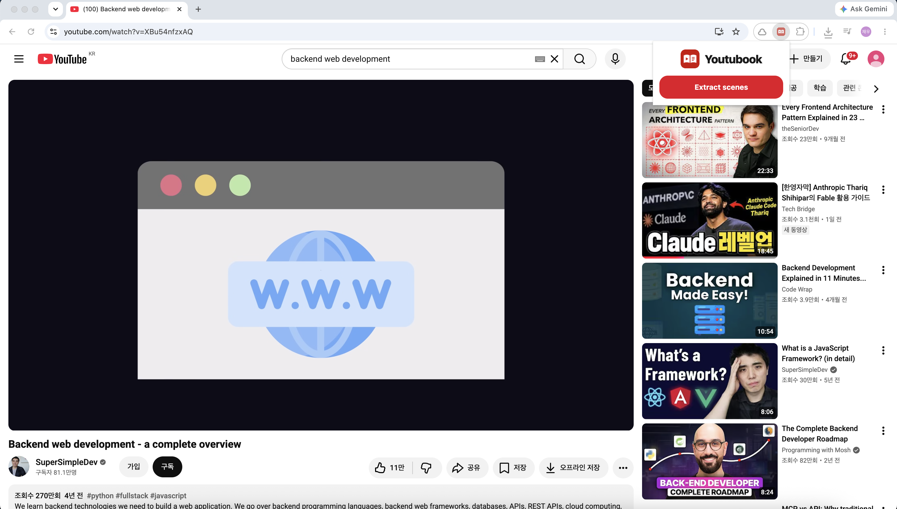
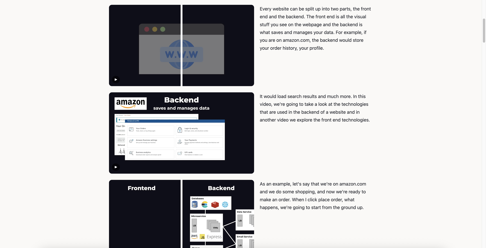
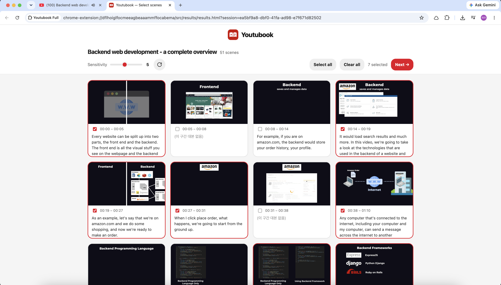

<div align="center">


# Youtubook

**유튜브 영상, 보지 말고 읽으세요.**<br>
Youtubook은 영상을 장면 스크린샷과 자막 대본이 어우러진 한 페이지로 바꿔 줍니다 — 전부 브라우저 안에서.


[English](README.md) · **한국어**

</div>

<table>
  <tr>
    <td width="47%"></td>
    <td width="6%" align="center"><h3>➡️</h3></td>
    <td width="47%"></td>
  </tr>
  <tr>
    <td align="center"><b>아무 유튜브 영상</b></td>
    <td></td>
    <td align="center"><b>읽을 수 있는 한 페이지</b></td>
  </tr>
</table>

Youtubook은 영상의 장면을 자동으로 나누고 각 장면을 자막 대본과 짝지어, 스크롤하며 읽는 한 페이지로 정리합니다. **30분짜리 강연을 다 보지 않고 몇 분 만에 아티클처럼 훑거나**, **동화 영상을 부모·교사가 읽어 줄 그림책으로** 소장할 수 있습니다. 자립형 HTML 페이지, PDF·PPTX, 또는 대본 TXT로 내보내세요.

모든 처리는 **100% 브라우저 안에서** 이뤄집니다 — AI도, 서버도, 영상 다운로드도 없습니다. 유튜브가 이미 제공하는 자막만 사용하며, 영상 스트림을 내려받거나 광고를 차단하거나 콘텐츠를 재호스팅하지 않습니다.

## 기능

- **장면 자동 검출** — HSV 색상 차이와 적응형(PySceneDetect 방식) 임계값으로 장면을 나눕니다. 민감도 슬라이더로 즉시 다시 검출할 수 있습니다.
- **자막에서 내레이션 추출** — 유튜브 자막(수동 자막 우선, 없으면 자동 생성 자막)에서 대본을 뽑아 각 장면에 맞춰 정렬합니다.
- **책으로 보기** — 완성된 페이지를 내려받지 않고 새 탭에서 바로 열어 읽습니다. 각 장면을 누르면 영상의 그 순간으로 바로 이동합니다.
- **여러 형식으로 내보내기** — 파일로 저장할 수도 있습니다: 화면 크기에 맞춰 배치가 바뀌어 폰부터 데스크톱까지 잘 읽히는 자립형 **HTML 페이지**(각 장면 스크린샷 옆에 자막 대본), PDF(장면당 한 페이지), PPTX(발표자 노트에 대본), TXT(대본만).
- **백그라운드 실행** — 추출하는 동안 다른 탭에서 작업해도 되고, 끝나면 알림으로 알려 줍니다.
- **한국어·영어 UI** — 브라우저 언어를 따라갑니다.

## 동작 방식

1. 유튜브 영상에서 Youtubook 아이콘을 클릭 → **그림책 생성**.
2. 영상을 훑어 장면 경계를 찾고, 장면마다 프레임을 한 장씩 캡처합니다.
3. 결과 페이지에서 원하는 장면을 고릅니다 — 민감도 슬라이더로 다시 검출할 수 있고, 카드마다 내레이션이 함께 표시됩니다.

<p align="center">
  
</p>

4. **다음** → **형식을 선택하세요**: **책으로 보기**로 새 탭에서 열거나, HTML·PDF·PPTX·TXT로 내려받습니다.

대본은 선택한 장면들이 영상 전체 타임라인을 나눠 갖습니다 — 각 장면이 "다음 선택 장면 직전까지"의 내레이션을 모두 담으므로, 장면을 일부만 골라도 대본이 빠지지 않습니다.

## 설치

**릴리스에서 설치**

1. [Releases](../../releases)에서 `youtubook-v<버전>.zip`을 내려받아 압축을 풉니다.
2. Chrome → `chrome://extensions` → **개발자 모드**를 켠 뒤 → **압축해제된 확장 프로그램 로드** → 압축을 푼 폴더(`manifest.json`이 들어 있는 폴더)를 선택합니다.

**직접 빌드**

1. `npm install && npm run build` → `dist/`가 생성됩니다.
2. Chrome → `chrome://extensions` → **개발자 모드**를 켠 뒤 → **압축해제된 확장 프로그램 로드** → `dist/`를 선택합니다.

요구사항: Chrome 111+

## 사용법

- 추출은 영상이 열린 탭에서 진행되지만, 그동안 **다른 탭에서 작업해도 됩니다** — 끝나면 알림이 옵니다. 다만 그 탭을 닫거나 다른 영상으로 이동하지는 마세요.
- 10분 영상 기준 약 1~3분 걸립니다(회선 속도에 따라 다름).
- 결과 페이지의 민감도 슬라이더로 장면을 더 잘게 또는 더 굵게 나눈 뒤 다시 검출하세요.

## 개발

```bash
npm install
npm run build   # 타입체크 + dist/ 빌드
npm test        # 단위 테스트 (Vitest)
npm run zip     # 빌드 + 배포용 zip(릴리스·웹스토어)
```

스택: TypeScript · Vite + @crxjs/vite-plugin · jsPDF · PptxGenJS

## 개인정보

Youtubook은 모든 처리를 브라우저 안에서 로컬로 수행합니다 — 영상 프레임, 자막, 생성된 파일이 기기를 벗어나지 않습니다. 자세한 내용은 [PRIVACY.md](PRIVACY.md)를 참고하세요.

## 제한사항

- 자막이 없는 영상은 장면 이미지만 만들어집니다(대본·TXT 없음).
- 라이브 방송, 프리미어, DRM 보호 영상은 지원하지 않습니다.
- 유튜브 페이지 구조가 바뀌면 일부 기능(예: 자막 추출)이 영향을 받을 수 있습니다.
