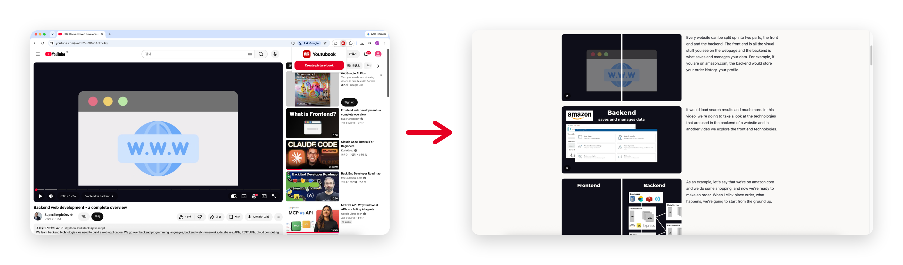

<div align="center">


# Youtubook

**Read a YouTube video instead of watching it.**<br>
Youtubook turns any video into an illustrated page — each scene's screenshot paired with its transcript — right in your browser.


**English** · [한국어](README.ko.md)

</div>

<div align="center">



<sub><b>Any YouTube video</b> &nbsp;→&nbsp; <b>an illustrated page you can read</b></sub>

</div>

Youtubook detects the distinct scenes in a video and pairs each with the transcript from its captions, laying them out as a scrollable illustrated page. **Skim a 30-minute talk in a couple of minutes** instead of watching it — or **turn a story video into a picture book** a parent or teacher can read aloud. Export it as a self-contained HTML page, a PDF or PPTX, or a plain-text script.

Everything runs **100% in your browser** — no AI, no server, no video downloads. It uses only the captions YouTube already exposes, and never downloads video streams, blocks ads, or re-hosts content.

## Features

- **Automatic scene detection** — HSV color-difference with an adaptive, PySceneDetect-style threshold; a sensitivity slider re-detects instantly.
- **Narration from captions** — pulls the script from YouTube captions (manual first, auto-generated as a fallback) and aligns it to each scene.
- **View as book** — open the finished page in a new browser tab and read it straight away, no download needed. Each scene links back to that exact moment in the video.
- **Multiple export formats** — or save it as a file: a self-contained, responsive **HTML page** that reads well on any screen from phone to desktop (each scene's screenshot beside its transcript), PDF (one scene per page), PPTX (script in the speaker notes), or TXT (script only).
- **Runs in the background** — switch to other tabs while it works; a notification tells you when it's done.
- **Bilingual UI** — English and Korean, following your browser language.

## How it works

1. Open a YouTube video, click the Youtubook icon → **Create picture book**.
2. Youtubook scans the video, detects scene cuts, and captures one frame per scene.
3. On the results page, pick the scenes you want — the sensitivity slider re-detects, and each card shows its narration.

<p align="center">
  
</p>

4. **Next** → **Choose a format**: **View as book** to open it in a new tab, or download as HTML / PDF / PPTX / TXT.

The script follows your selected scenes: each chosen scene carries all narration up to the next selected scene, so picking only some scenes never drops any of the story.

## Install

**From a release**

1. Download `youtubook-v<version>.zip` from the [Releases](../../releases) page and unzip it.
2. Chrome → `chrome://extensions` → enable **Developer mode** → **Load unpacked** → select the unzipped folder (the one containing `manifest.json`).

**Build it yourself**

The **Full** and **Lite** editions build from the same source:

```bash
npm install
npm run build            # Youtubook Full → dist/          (every feature, incl. downloads)
npm run build:webstore   # Youtubook Lite → dist-webstore/  (view-as-book only, no downloads)
```

Then Chrome → `chrome://extensions` → enable **Developer mode** → **Load unpacked** → select `dist/` (or `dist-webstore/`).

The **Full** edition (this repo / Releases) has every feature. **Lite** is a download-free build intended for the Chrome Web Store — it keeps "View as book" and links back here for the full version.

Requires Chrome 111+.

## Usage

- Extraction runs on the video's tab, but you can **switch to other tabs** while it works — you'll get a notification when the page is ready. Just don't close the tab or navigate it to another video.
- Roughly 1–3 minutes for a 10-minute video, depending on your connection.
- On the results page, use the sensitivity slider to split scenes more or less finely, then re-detect.

## Development

```bash
npm install
npm run build            # type-check + build Full → dist/
npm run build:webstore   # build the download-free Lite (Web Store) → dist-webstore/
npm test                 # unit tests (Vitest)
npm run zip              # build + zip the Full edition for a release
npm run zip:webstore     # build + zip the Lite edition for the Chrome Web Store
```

The two editions share one codebase; a build-time `VITE_EDITION` flag drops all download/export code from the Lite build. Stack: TypeScript · Vite + @crxjs/vite-plugin · jsPDF · PptxGenJS

## Privacy

Youtubook processes everything locally in your browser — video frames, captions, and generated files never leave your machine. See [PRIVACY.md](PRIVACY.md).

## Limitations

- Videos without captions produce scene images only (no script / TXT).
- Live streams, premieres, and DRM-protected videos aren't supported.
- YouTube page changes can affect some features (e.g. caption extraction).

## Roadmap

Youtubook is still growing. On the wishlist — **contributions welcome** (see below):

- [ ] **More export targets** — send a book straight to **Notion**, **Obsidian**, or Markdown, beyond today's HTML / PDF / PPTX / TXT.
- [ ] **Speech-to-text fallback** — optional on-device transcription (e.g. Whisper) for videos that have no captions.
- [ ] **Wider coverage** — YouTube Shorts support and more resilient caption handling.

Got another idea? [Open an issue](../../issues).

## Contributing

Contributions of every kind are welcome — bug fixes, features, docs, translations. The **Roadmap** items above are especially good places to jump in, and a great excuse to say hi. New file-based export formats start from [`src/results/exporters.ts`](src/results/exporters.ts), built on the shared book data in [`src/results/book-data.ts`](src/results/book-data.ts). [Open an issue](../../issues) to discuss, or send a pull request.

## License

[MIT](LICENSE) © 2026 legojeon

Bundled third-party libraries keep their own licenses — see [THIRD_PARTY_LICENSES.md](THIRD_PARTY_LICENSES.md). Scene detection reimplements the algorithm of [PySceneDetect](https://www.scenedetect.com/) (BSD-3-Clause) from scratch; no PySceneDetect code is included.
